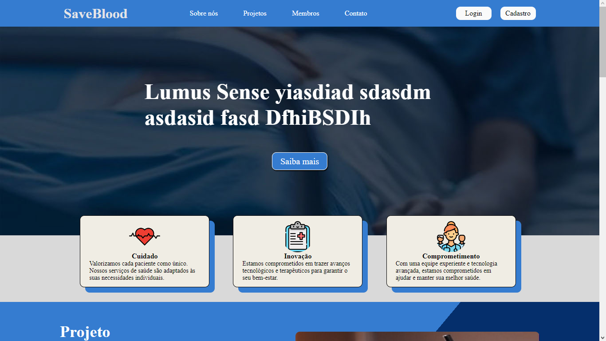

<h1 align="center"> Save Blood </h1>

Site institucional  

  

 

  <h3 align='center'>Web</h3>
  

## ✅ Status

 - Em produção ✅

## 🚀 Tecnologias

Esse projeto foi desenvolvido com as seguintes tecnologias:

- HTML
- CSS

## 💻 Projeto

Este é o site institucional para o projeto da segunda Sprint da SPTech

## :memo: Licença

Esse projeto está sob a licença MIT.
